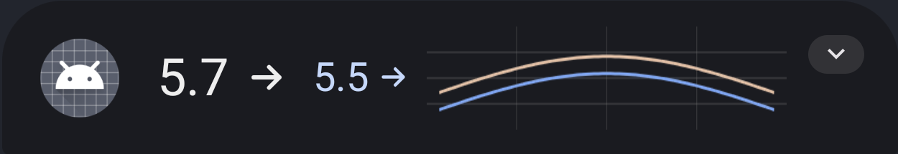
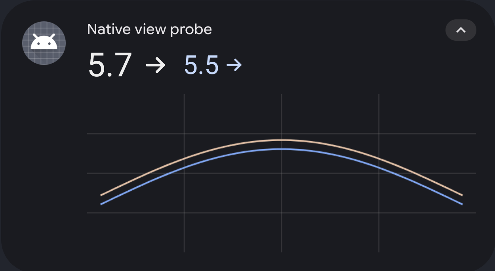
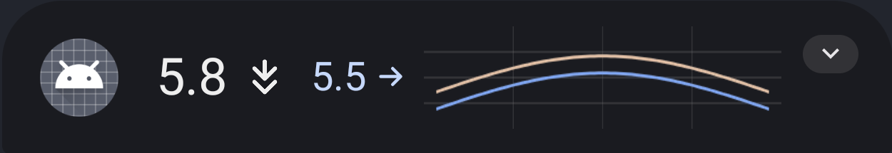
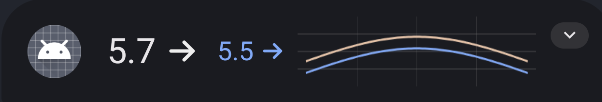
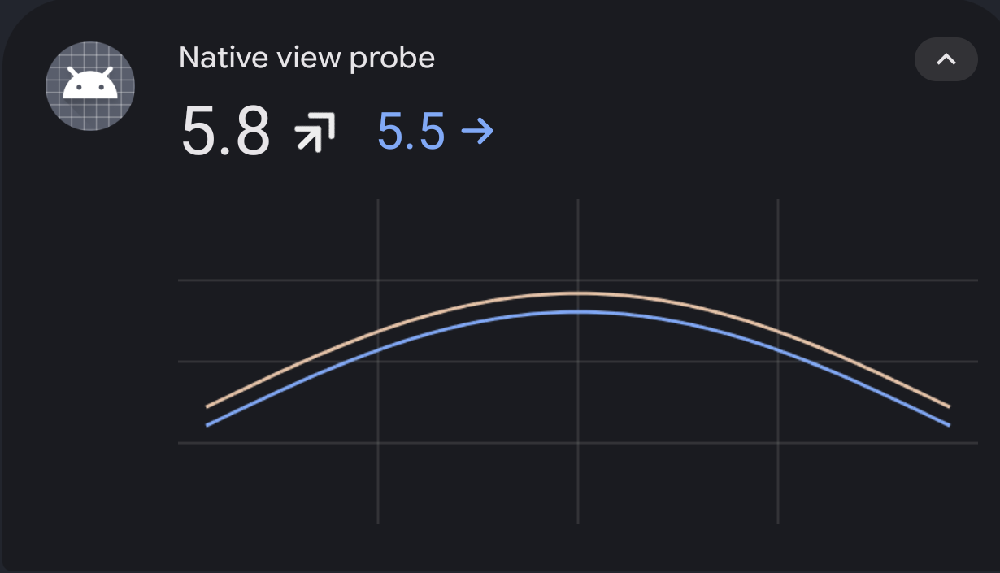
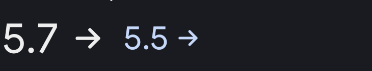
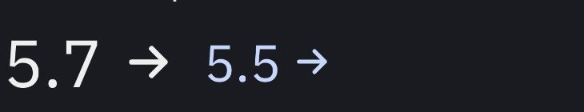

# Native notification text/vector device probe

Standalone package `tk.glucodata.nativeviewprobe`, notification ID `8104`.
Synthetic values only; no CGM APIs, drivers, storage, services, or installed-app
replacement. Uses `DecoratedCustomViewStyle`, platform notification title text
appearance, real primary/peer TextViews, resource vectors inside RotateDrawables,
and a bitmap chart. The default and double-head geometry follows the app's arrow.

## Initial XML-font probe, 2026-10-04

Pixel 8 Pro, Android 17/API 37, build `CP41.260831.007`, target SDK 37:

- Compact and expanded content render successfully in System UI.
- Resource vector rotation via `setImageLevel` and tint via `setColorFilter` work.
- Updating the value and selecting a double arrow work. Closing/reopening the
  shade retains the latest value (`5.8`) and double rising arrow.
- XML `android:fontFamily="@font/ibm_plex_sans_var"` loads IBM Plex in ordinary
  app XML and local RemoteViews inflation. Local compact text measurement for
  `5.7 268` changes from 237 to 252 pixels, with different Typeface identities.
- In the actual shade, the system-font and XML-IBM compact probe regions are
  pixel-identical: 258,300 pixels compared, zero changed. Cancelling, waiting,
  and posting a fresh IBM notification gives the same result, so notification
  reapplication alone does not explain it. The shade falls back to the system
  font on this build; local inflation success is insufficient proof of font support.

This verifies the static native rendering recipe on one modern device. It does
not validate smooth internal animation, TalkBack traversal, large accessibility
settings, light-theme shade behavior, or full-app lifecycle/data ingestion.
The primary arrow color is deliberately fixed for the dark-shade probe, not a
production color policy. The chart is a synthetic visual test, not CGM data.

The production mode also compiled the actual `CustomGlucoseNotification` and
`TrendArrowAngle` source, copied the production XML/vector resources, and used
the compiled production `ValueItem` and `SensorVisuals` classes. Its compact and
expanded views render in the shade. Updating to `5.8` and a double falling
arrow survives closing/reopening the shade; the peer retains its own steady
arrow. This tests the production presenter with synthetic inputs, not the
full CGM app's ingestion/lifecycle. The installed CGM app was unchanged.







System font:



XML bundled-font variant, cancelled and freshly reposted:


Expanded native values and resource double arrow:



## Reproduce

The build uses Android SDK `android-37.0` and build-tools `37.0.0`, with
`ANDROID_HOME`/`JAVA_HOME` overrides. It copies the repository's actual bundled
font into ignored build resources; no duplicate font asset is checked in.
First compile `:Common:compileMobileDebugJavaWithJavac` and
`:Common:compileMobileDebugKotlin`. The probe includes only the required pure
presentation helpers, not the full renderer or driver classes. Set
`GRADLE_USER_HOME` to the cache containing Kotlin 2.4.10, or specify its stdlib
jar via `PROBE_KOTLIN_STDLIB`.

```sh
sh tools/notification-native-view-probe/build.sh
probe_serial='YOUR_PIXEL_SERIAL'
adb -s "$probe_serial" install -r -g tools/notification-native-view-probe/out/native-view-probe.apk
adb -s "$probe_serial" shell am start -S -W -n tk.glucodata.nativeviewprobe/.ProbeActivity --ez ibm false --ei step 0
adb -s "$probe_serial" shell am broadcast -n tk.glucodata.nativeviewprobe/.ProbeReceiver --ez ibm true --ei step 0

# Eliminate reapplication as the cause of an unchanged font.
adb -s "$probe_serial" shell am broadcast -n tk.glucodata.nativeviewprobe/.ProbeReceiver --ez cancel true
sleep 1
adb -s "$probe_serial" shell am broadcast -n tk.glucodata.nativeviewprobe/.ProbeReceiver --ez ibm true --ei step 0

# Synthetic update and a double arrow, then expand/reopen the shade.
adb -s "$probe_serial" shell am broadcast -n tk.glucodata.nativeviewprobe/.ProbeReceiver --ez ibm false --ei step 3

# Exercise the actual production presenter/resources with synthetic inputs.
adb -s "$probe_serial" shell am start -S -W -n tk.glucodata.nativeviewprobe/.ProbeActivity --ez production true --ei step 0
adb -s "$probe_serial" shell am broadcast -n tk.glucodata.nativeviewprobe/.ProbeReceiver --ez production true --ei step 3
adb -s "$probe_serial" logcat -d -v threadtime NativeViewProbe:I NotifContentInflater:E '*:S'
adb -s "$probe_serial" uninstall tk.glucodata.nativeviewprobe
```

The preview was removed at the end of each check.

## Font-selection repair, 2026-10-05

The initial recipe incorrectly treated the generic platform notification style
as the configured system font and removed IBM Plex support. The corrected
production presenter accepts the existing family preference (unset means IBM).
IBM values are rendered in-app using the bundled font, including compound spans,
with actual layout metrics and bounded 2x-density transport. Arrows remain vectors.
System regular/medium values stay TextViews with named configured headline-family
spans; light weight uses the app-side painter to preserve the configured family
while applying numeric weight.

On the same Pixel, `cmd overlay lookup android android:string/config_headlineFontFamily`
returns `google-sans`, medium returns `google-sans-medium`, and body returns
`google-sans-text`. Generic `sans-serif` is a different family. Do not describe
unmodified notification Title text appearance as Google Sans.

The actual production presenter/resources were checked in the shade with:

```sh
adb -s "$probe_serial" shell am start -S -W -n tk.glucodata.nativeviewprobe/.ProbeActivity --ez production true --ez ibm true --ei step 0
adb -s "$probe_serial" shell am broadcast -n tk.glucodata.nativeviewprobe/.ProbeReceiver --ez production true --ez ibm false --ei step 0
adb -s "$probe_serial" shell am broadcast -n tk.glucodata.nativeviewprobe/.ProbeReceiver --ez production true --ez ibm true --ei step 0
```

Compact and expanded IBM content rendered successfully. In the expanded value
region (730 x 140 pixels), IBM versus System changes 7,530 pixels; switching
System back to IBM restores the original crop exactly (zero changed pixels).
This uses the same notification ID, exercising System UI reapplication. These
are synthetic inputs; the installed CGM app was unchanged. The preview was removed.

IBM Plex:


Configured System (Google Sans on this Pixel):



Switched back to IBM Plex:


